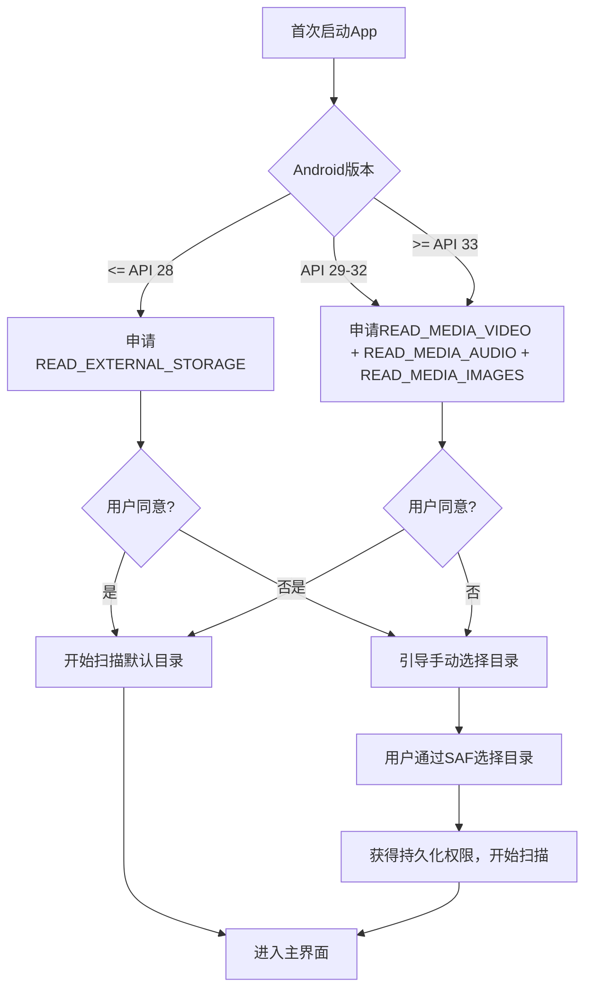

# 安卓媒体播放器 技术设计文档 v1.0

## 1. 文档概述

### 1.1 文档目的
本文档为安卓媒体播放器项目的技术设计方案，基于PRD需求描述，明确技术选型、架构设计、模块拆分、数据库设计、适配方案和开发计划，作为开发实现的指导文档。

### 1.2 范围覆盖
本文档覆盖所有核心功能和扩展功能的技术实现设计，包括：
- 整体架构设计和技术选型
- 分层模块拆分与依赖关系
- 数据库表结构设计
- 关键功能技术实现方案
- 权限适配和分区存储适配
- 画中画实现方案
- 开发计划和里程碑

---

## 2. 技术选型与理由

### 2.1 开发语言
| 选型 | Kotlin | Java |
|------|--------|------|
| 选择 | ✅ | ❌ |

**理由：**
1. Kotlin是Google官方推荐的Android开发语言，语法简洁，空安全特性减少NPE crash
2. 支持协程，简化异步编程，更适合处理IO密集型任务（媒体扫描、数据库操作）
3. 与Java完全兼容，可以复用成熟的Java开源库
4. 现代Android开发生态对Kotlin支持更好，Jetpack组件天然适配Kotlin

### 2.2 构建系统
| 选型 | Gradle Kotlin DSL | Groovy |
|------|-------------------|--------|
| 选择 | ✅ | ❌ |

**理由：**
1. 类型安全，编译期错误检查
2. IDE支持更好，代码补全更完善
3. Google官方推荐，未来趋势
4. 便于依赖版本管理和配置维护

### 2.3 架构模式
| 选型 | MVVM + Clean Architecture | MVI | MVC | MVP |
|------|----------------------------|-----|-----|-----|
| 选择 | ✅ | ❌ | ❌ | ❌ |

**理由：**
1. MVVM配合Jetpack ViewModel/LiveData，符合官方推荐架构
2. 清晰的分层（数据层-域名层-表现层），关注点分离，便于单元测试
3. Clean Architecture保证依赖方向正确，外层依赖内层，业务逻辑不依赖框架
4. MVI对于这个项目复杂度来说过重，增加开发成本，收益不明显

### 2.4 依赖注入
| 选型 | Hilt | Dagger | Koin | 手动注入 |
|------|------|--------|------|---------|
| 选择 | ✅ | ❌ | ❌ | ❌ |

**理由：**
1. Google官方推荐，与Jetpack深度集成
2. 编译期处理，运行时性能更好
3. 配置简洁，相比Dagger减少样板代码
4. 社区活跃，文档完善

### 2.5 异步处理
| 选型 | Kotlin Coroutines + Flow | RxJava | AsyncTask |
|------|---------------------------|--------|-----------|
| 选择 | ✅ | ❌ | ❌ |

**理由：**
1. 语言原生支持，代码更简洁易读
2. Flow支持冷流，适合处理连续数据流（媒体扫描进度等）
3. 协程取消机制完善，避免内存泄漏
4. 与Jetpack生命周期集成更好，自动取消

### 2.6 本地数据库
| 选型 | Room SQLite | 原生SQLite | Realm |
|------|-------------|------------|-------|
| 选择 | ✅ | ❌ | ❌ |

**理由：**
1. Jetpack官方组件，SQLite封装，使用方便
2. 支持编译期SQL检查，减少错误
3. 支持Kotlin协程和Flow，便于异步操作
4. 轻量级，不增加额外运行时开销，符合我们轻量定位

### 2.7 音视频解码
| 选型 | ExoPlayer + FFmpeg extension | 原生MediaPlayer | 纯FFmpeg |
|------|--------------------------------|-----------------|----------|
| 选择 | ✅ | ❌ | ❌ |

**理由：**
1. ExoPlayer是Google官方推荐的现代媒体播放器
2. 支持硬解码，性能更好，省电
3. 扩展FFmpeg支持更多小众格式，满足需求
4. 内置支持画中画、多分辨率、自适应码率等功能
5. 官方维护更新，兼容性更好
6. 开源，可定制性强

### 2.8 图片加载
| 选型 | Coil | Glide | Picasso | Fresco |
|------|------|-------|---------|--------|
| 选择 | ✅ | ❌ | ❌ | ❌ |

**理由：**
1. Kotlin原生开发，专为Co设计，性能优秀
2. 体积小（~1MB），符合我们轻量定位
3. 支持Kotlin协程，API简洁
4. 默认支持GIF、WebP等动态图片格式
5. 内存管理更好，避免OOM

### 2.9 权限处理
| 选型 | Accompanist Permissions | 原生Activity Result API | 第三方库 |
|------|--------------------------|-------------------------|---------|
| 选择 | ✅ | ⚠️ 备选 | ❌ |

**理由：**
1. Google官方提供，Jetpack生态
2. 简化权限请求流程，API简洁
3. 生命周期感知，避免内存泄漏
4. 支持不同Android版本权限适配

### 2.10 路由框架
| 选型 | 原生Activity Result API + 显式Intent | 第三方路由框架 |
|------|----------------------------------------|----------------|
| 选择 | ✅ | ❌ |

**理由：**
1. 本项目模块不多，不需要复杂路由
2. 原生API足够，减少三方依赖，减小体积
3. 编译期检查，避免运行时错误
4. 更符合AOT编译优化，启动更快

### 2.11 测试框架
| 单元测试 | JUnit 5 + MockK |
| 集成测试 | Espresso |
| 静态代码检查 | Detekt + KtLint |

**理由：**
1. JUnit 5新一代测试框架，功能更强配置更灵活
2. MockK原生支持Kotlin，mock更自然
3. Detekt支持Kotlin代码风格检查和潜在bug检测
4. KtLint自动格式化代码，保证代码风格一致

---

## 3. 架构设计与分层模块拆分

### 3.1 整体架构
采用**Clean Architecture + MVVM**架构，分为四层，依赖关系从外层指向内层：

```
Presentation Layer (表现层)
    ↓ depends on
Domain Layer (域名层/业务逻辑层)
    ↓ depends on
Data Layer (数据层)
    ↓ depends on
Device/Network Layer (设备/网络层)
```

### 3.2 模块结构拆分

#### 3.2.1 模块划分（按功能）
```
app/                           # 应用入口层
├── src/main/
│   └── com/shen/mediaplayer/
│       ├── MyApplication.kt
│       ├── di/                # Hilt依赖注入模块
│       └── ...
│
features/                      # 功能模块
├── feature-splash/            # 启动页/欢迎引导
├── feature-home/              # 首页主界面
├── feature-videolist/         # 视频列表
├── feature-audiolist/         # 音频列表
├── feature-imagelist/         # 图片列表
├── feature-folders/           # 文件夹浏览
├── feature-videoplayer/       # 视频播放
├── feature-audioplayer/       # 音频播放
├── feature-imagebrowser/      # 图片浏览
├── feature-playbackhistory/   # 播放历史
├── feature-playlist/          # 自定义歌单
├── feature-settings/          # 设置页
└── feature-search/            # 搜索功能

core/                          # 核心基础模块
├── core-common/               # 公共工具类、扩展函数、常量
├── core-ui/                   # 公共UI组件、主题、样式
├── core-navigation/           # 导航定义
├── core-domain/               # 通用domain接口定义
└── core-database/             # 数据库通用实现

data/                          # 数据实现层
├── data-local/                # 本地数据存储（Room DB、SP）
├── data-repository/           # Repository实现
└── data-media/                # 媒体文件扫描处理

media/                         # 媒体播放核心模块
├── media-decoder/             # 解码封装
└── media-player/              # 播放器封装

utils/                         # 工具类模块
├── utils-permission/          # 权限处理工具
├── utils-storage/             # 存储处理工具
└── utils-image/               # 图片处理工具
```

### 3.3 依赖关系
- **app模块**：依赖所有feature模块和core模块
- **feature模块**：只依赖core模块，不依赖其他feature模块，功能独立
- **core模块**：不依赖任何上层模块，只提供基础能力
- **data模块**：依赖core模块，实现domain层定义的接口
- **media模块**：依赖core模块，提供播放器能力给上层使用
- **utils模块**：被所有上层模块依赖，本身不依赖上层

**依赖原则：**
1. 反向依赖实现，抽象在内层，实现在外层
2. 功能模块之间不直接依赖，通过core-domain定义的接口通信
3. 保持模块间松耦合，便于独立测试和维护

### 3.4 各层职责

**1. 表现层 (Presentation Layer)**
- 职责：界面展示、用户交互处理、状态管理
- 组件：Activity/Fragment、ViewModel、UI State、Adapter
- 使用Jetpack Compose还是View System？**选型：View System + XML**
  - 理由：对于播放器类应用，自定义View较多，View System生态更成熟，自定义绘制更灵活，学习成本更低

**2. 域名层 (Domain Layer)**
- 职责：业务逻辑抽象、Use Case定义、数据接口定义
- 组件：Use Case、Repository接口、实体模型
- 特点：不依赖任何框架，纯Kotlin编写，可独立单元测试

**3. 数据层 (Data Layer)**
- 职责：数据获取、数据转换、数据缓存
- 组件：Repository实现、Room实体、Mapper、MediaScanner
- 特点：实现Domain层定义的接口，对内屏蔽数据源细节

**4. 设备层 (Device Layer)**
- 职责：适配系统API、硬件访问、存储访问
- 组件：存储工具、权限工具、系统服务封装

---

## 4. 数据库表结构设计

采用Room SQLite数据库，数据库名称：`media_player.db`，版本：`1`

### 4.1 表清单

| 表名 | 用途 |
|------|------|
| `playback_history` | 播放历史记录 |
| `favorites` | 收藏记录 |
| `hidden_folders` | 隐藏文件夹配置 |
| `playlists` | 自定义歌单 |
| `playlist_entries` | 歌单曲目关联表 |
| `app_config` | 应用配置缓存 |

---

### 4.2 详细表结构

#### 4.2.1 `playback_history` - 播放历史表

| 字段名 | 类型 | 约束 | 说明 |
|--------|------|------|------|
| `id` | INTEGER | PRIMARY KEY AUTOINCREMENT | 主键ID |
| `file_path` | TEXT | UNIQUE NOT NULL | 文件绝对路径 |
| `file_name` | TEXT | NOT NULL | 文件名 |
| `file_size` | LONG | | 文件大小(字节) |
| `media_type` | INTEGER | NOT NULL | 媒体类型 1:视频 2:音频 3:图片 |
| `duration` | LONG | | 媒体时长(毫秒) |
| `progress` | LONG | NOT NULL DEFAULT 0 | 当前播放进度(毫秒) |
| `folder_path` | TEXT | NOT NULL | 所在文件夹路径 |
| `last_played_at` | LONG | NOT NULL | 最后播放时间戳(毫秒) |
| `created_at` | LONG | NOT NULL DEFAULT (strftime('%s','now') * 1000) | 创建时间 |
| `updated_at` | LONG | NOT NULL DEFAULT (strftime('%s','now') * 1000) | 更新时间 |

**索引：**
- `idx_last_played_at`: `last_played_at` DESC，用于播放历史列表排序
- `idx_file_path`: `file_path`，用于快速查询进度

---

#### 4.2.2 `favorites` - 收藏表

| 字段名 | 类型 | 约束 | 说明 |
|--------|------|------|------|
| `id` | INTEGER | PRIMARY KEY AUTOINCREMENT | 主键ID |
| `file_path` | TEXT | UNIQUE NOT NULL | 文件绝对路径 |
| `file_name` | TEXT | NOT NULL | 文件名 |
| `media_type` | INTEGER | NOT NULL | 媒体类型 1:视频 2:音频 3:图片 |
| `folder_path` | TEXT | NOT NULL | 文件夹路径 |
| `created_at` | LONG | NOT NULL DEFAULT (strftime('%s','now') * 1000) | 收藏时间 |

**索引：**
- `idx_media_type`: `media_type`，按类型筛选收藏

---

#### 4.2.3 `hidden_folders` - 隐藏文件夹表

| 字段名 | 类型 | 约束 | 说明 |
|--------|------|------|------|
| `id` | INTEGER | PRIMARY KEY AUTOINCREMENT | 主键ID |
| `folder_path` | TEXT | UNIQUE NOT NULL | 文件夹绝对路径 |
| `folder_name` | TEXT | NOT NULL | 文件夹名称 |
| `is_protected` | INTEGER | NOT NULL DEFAULT 0 | 是否需要密码保护 0:否 1:是 |
| `created_at` | LONG | NOT NULL DEFAULT (strftime('%s','now') * 1000) | 创建时间 |

---

#### 4.2.4 `playlists` - 自定义歌单表

| 字段名 | 类型 | 约束 | 说明 |
|--------|------|------|------|
| `id` | INTEGER | PRIMARY KEY AUTOINCREMENT | 歌单ID |
| `name` | TEXT | NOT NULL | 歌单名称 |
| `description` | TEXT | | 歌单描述 |
| `cover_path` | TEXT | | 封面图片路径 |
| `created_at` | LONG | NOT NULL DEFAULT (strftime('%s','now') * 1000) | 创建时间 |
| `updated_at` | LONG | NOT NULL DEFAULT (strftime('%s','now') * 1000) | 更新时间 |

---

#### 4.2.5 `playlist_entries` - 歌单曲目关联表

| 字段名 | 类型 | 约束 | 说明 |
|--------|------|------|------|
| `id` | INTEGER | PRIMARY KEY AUTOINCREMENT | 主键ID |
| `playlist_id` | INTEGER | NOT NULL | 关联歌单ID (外键 -> playlists.id) |
| `file_path` | TEXT | NOT NULL | 音频文件路径 |
| `file_name` | TEXT | NOT NULL | 音频文件名 |
| `sort_order` | INTEGER | NOT NULL DEFAULT 0 | 排序位置，用于手动拖拽排序 |
| `added_at` | LONG | NOT NULL DEFAULT (strftime('%s','now') * 1000) | 添加时间 |

**索引：**
- `idx_playlist_id`: `playlist_id`，用于查询歌单内所有歌曲
- `idx_sort_order`: `playlist_id, sort_order`，用于保持排序

---

#### 4.2.6 `app_config` - 应用配置表

| 字段名 | 类型 | 约束 | 说明 |
|--------|------|------|------|
| `key` | TEXT | PRIMARY KEY NOT NULL | 配置键 |
| `value` | TEXT | | 配置值(JSON序列化) |
| `updated_at` | LONG | NOT NULL DEFAULT (strftime('%s','now') * 1000) | 更新时间 |

**预定义配置Key：**
- `scan_directories`: 自定义扫描目录列表(JSON数组)
- `player_settings`: 播放器设置(JSON对象)
- `ui_settings`: UI设置(JSON对象)
- `online_enabled`: 是否开启在线功能 (boolean)

---

## 5. 分区存储适配方案

### 5.1 Android分区存储变更回顾
- **Android 10 (API 29)**：引入分区存储，限制应用访问外部存储的自由访问
- **Android 11 (API 30)**：分区存储成为强制，MANAGE_EXTERNAL_STORAGE允许访问所有文件
- **Android 13 (API 33)**：进一步细分媒体权限，READ_MEDIA_VIDEO/AUDIO/IMAGES取代原存储权限

### 5.2 适配方案设计

**适配策略：按版本区分处理**

| Android版本 | 适配方案 |
|------------|---------|
| <= API 28 (Android 8-9) | 继续使用原始的READ_EXTERNAL_STORAGE / WRITE_EXTERNAL_STORAGE |
| API 29-30 (Android 10-11) | 使用分区存储API，访问媒体文件通过MediaStore，访问应用专享目录保持不变 |
| >= API 31-32 (Android 12) | 同API 29-30，使用MediaStore API |
| >= API 33 (Android 13+) | 使用细分的READ_MEDIA_VIDEO / READ_MEDIA_AUDIO / READ_MEDIA_IMAGES权限 |

### 5.3 媒体文件访问实现
1. **媒体库扫描流程**：
   - 使用MediaStore API查询系统媒体库，获取所有媒体文件信息
   - 用户添加自定义扫描目录时，使用SAF (Storage Access Framework)让用户选择目录，获取持久化权限
   - 对于需要浏览全部文件树的文件夹浏览功能，在Android 11+推荐用户申请MANAGE_EXTERNAL_STORAGE权限，获得完整文件访问能力

2. **持久化URI权限**：
   - 使用SAF获取目录访问权限后，持久化保留URI权限到应用存储空间
   - 通过`takePersistableUriPermission`方法保留长期访问权限

3. **文件修改/删除操作**：
   - 对于MediaStore中的媒体文件，使用MediaContract提供的API进行修改删除
   - 对于应用专有的目录，直接使用File API操作

### 5.4 权限申请流程



---

## 6. 画中画实现方案

### 6.1 权限修正说明
之前的设计中错误地认为画中画需要`SYSTEM_ALERT_WINDOW`权限，实际修正：

- **Android 8.0+ (API 26+)**：画中画是系统提供的原生支持，不需要`SYSTEM_ALEWINDOW`权限
- 正确的做法：在`AndroidManifest.xml`中为`VideoPlayActivity`配置画中画属性
- `SYSTEM_ALEWINDOW`权限对于画中画**不是必需的**，仅用于其他悬浮窗场景

### 6.2 AndroidManifest配置

```xml
<activity
    android:name=".feature_videoplayer.VideoPlayerActivity"
    android:supportsPictureInPicture="true"
    android:configChanges="screenSize|smallestScreenSize|screenLayout|orientation">
```

### 6.3 实现流程

1. **进入画中画条件检查**：
   - 检查系统版本 >= Android 8.0
   - 检查是否在应用设置中启用了画中画功能（默认开启，用户可关闭）
   - 检查系统是否允许当前应用使用画中画

2. **自动触发机制**：
   - 用户点击Home键或返回桌面时，系统自动触发进入画中画模式
   - Activity需要重写`onUserLeaveHint()`方法，在适当的时候主动进入画中画

3. **手动触发机制**：
   - 在播放界面更多菜单中增加"进入画中画"按钮
   - 点击后调用API主动进入画中画模式

4. **画中画控制**：
   - 使用`PictureInPictureParams`设置画中画窗口比例和动作
   - 在画中画模式下，通过`MediaSession`提供播放控制
   - 更新画中画的Action，添加播放/暂停/前进/后退控制按钮

5. **画中画生命周期处理**：
   - 进入画中画后，保持播放继续，隐藏界面多余控件
   - 用户点击画中画窗口，恢复到全屏播放Activity
   - 画中画关闭时，如果之前正在播放，可以选择暂停或继续

### 6.4 不同版本兼容处理
- **API < 26**: 不支持画中画，隐藏入口
- **API 26-30**: 使用基础画中画功能
- **API >= 31**: 支持更完善的自定义动作和圆角处理

---

## 7. 核心功能技术实现要点

### 7.1 媒体扫描

- 使用`Coroutine`后台扫描，通过`Flow`发送扫描进度给UI层
- 支持暂停和取消扫描
- 扫描结果增量更新到数据库，避免每次全量更新
- 使用`ExifInterface`提取媒体缩略图信息

### 7.2 视频播放器封装

- 基于ExoPlayer封装VideoPlayerManager，单例模式管理播放器生命周期
- 支持横竖屏切换时不重启Activity，使用`configChanges`处理配置变化
- 支持硬解码优先，用户可手动切换到软解码

### 7.3 音频后台播放

- 使用`MediaSession`+`MediaBrowserService`实现后台播放
- 支持通知栏控制，适配Android 13+通知权限
- 锁屏封面显示，从音频文件metadata提取

### 7.4 歌词显示

- 匹配同文件名`.lrc`后缀的歌词文件
- 解析LRC格式歌词，定时更新当前显示歌词行
- 支持歌词拖动，点击跳转对应进度

### 7.5 隐私保护

- 在线功能默认关闭，未开启时不声明INTERNET权限
- 使用gradle `manifestPlaceholders`动态控制权限声明
- 未开启在线功能时，移除所有网络相关代码的初始化

---

## 8. 开发计划与里程碑

### 8.1 项目工期总预估：**4周**

### 8.2 里程碑划分

#### **Milestone 1：基础架构搭建 (第1周)**

**目标：完成项目初始化、基础架构搭建、核心依赖配置**

完成内容：
- [ ] 项目创建、git仓库初始化
- [ ] Gradle配置搭建，模块划分完成
- [ ] 基础Hilt依赖注入配置
- [ ] Room数据库创建，所有表结构实现
- [ ] 基础主题、UI组件库搭建
- [ ] 权限处理工具、存储工具封装完成
- [ ] 引导页+首次启动权限流程开发完成

**验收：** 能正常启动App，完成首次引导，权限申请流程正常，数据库创建成功

---

#### **Milestone 2：核心媒体库功能 (第2周)**

**目标：完成媒体库核心功能开发**

完成内容：
- [ ] 媒体文件扫描模块开发完成
- [ ] 分区存储适配完成，各Android版本兼容
- [ ] 视频列表模块开发完成，网格展示
- [ ] 音频列表模块开发完成，分类展示
- [ ] 图片列表模块开发完成，网格预览
- [ ] 文件夹浏览模块开发完成，层级导航
- [ ] 搜索功能开发完成
- [ ] 收藏功能开发完成
- [ ] 播放历史功能开发完成
- [ ] 文件管理功能开发完成（删除/重命名/移动/分享/隐藏）

**验收：** 能正常扫描媒体文件，四大主Tab功能完整，文件操作正常，隐藏文件夹生效

---

#### **Milestone 3：播放核心功能 (第3周)**

**目标：完成音视频播放和图片浏览核心功能**

完成内容：
- [ ] ExoPlayer集成和封装完成
- [ ] FFmpeg扩展集成完成，支持全格式
- [ ] 视频播放器界面开发完成
- [ ] 手势控制实现（亮度/音量/进度/快进退）
- [ ] 倍速播放、缩放模式切换等功能完成
- [ ] 画中画功能开发完成，适配正确
- [ ] 音频播放器开发完成，后台播放+通知栏控制
- [ ] 自定义歌单功能开发完成
- [ ] 歌词显示功能开发完成
- [ ] 图片浏览功能开发完成，手势缩放+滑动切换
- [ ] 字幕加载功能完成

**验收：** 所有主流格式音视频能正常播放，手势响应正常，画中画功能正常，后台播放正常，图片浏览流畅

---

#### **Milestone 4：扩展功能+优化测试 (第4周)**

**目标：完成扩展功能、性能优化、测试修复bug**

完成内容：
- [ ] 设置页面开发完成
- [ ] 深色模式适配完成
- [ ] 睡眠定时功能完成
- [ ] 密码保护功能开发完成
- [ ] 在线功能模块开发（可选，默认关闭）
- [ ] 性能优化：启动优化、内存优化、体积优化
- [ ] 适配不同屏幕尺寸（手机/折叠屏/平板）
- [ ] 兼容性测试，覆盖主要Android版本
- [】bug修复和稳定化
- [】签名打包，发布准备

**验收：** 所有功能开发完成，性能指标满足PRD要求，无严重crash，安装包体积<25MB，可发布Beta版本

---

### 8.3 资源需求
- 开发人力：1名Android开发工程师
- 外部依赖：ExoPlayer 依赖Google开源，FFmpeg编译可以使用预编译库
- 测试设备：需要覆盖Android 8.0到Android 14不同版本的测试设备

---

## 9. 风险评估与应对

| 风险 | 影响 | 应对措施 |
|------|------|----------|
| FFmpeg体积过大 | 安装包体积超过限制 | 使用轻量编译，只开启需要的格式支持，采用ABI拆分，Google Play提供不同ABI分包 |
| 不同厂商ROM兼容性问题 | 部分机型权限/画中画不正常 | 调研主流厂商适配方案，测试阶段覆盖主流品牌机型 |
| 分区存储适配复杂 | 开发延期，部分机型文件访问不正常 | 参考Google官方文档，使用成熟开源库辅助，充分测试各个版本 |
| 性能不达标 | 用户体验差 | 开发过程中持续Profile性能，及时优化，冷启动优化、图片缓存优化 |

---

## 10. 附录

### 10.1 依赖版本参考

```
Kotlin: 1.9.20
Gradle: 8.2
AGP: 8.2.0
ExoPlayer: 1.1.0
Hilt: 2.48
Room: 2.6.1
Coil: 2.5.0
Accompanist: 0.32.0
JUnit: 5.10.0
MockK: 1.13.8
```

### 10.2 权限清单（最终修正）

| 权限 | Android版本 | 必需性 | 用途 |
|------|------------|--------|------|
| `READ_EXTERNAL_STORAGE` | <= API 32 | 必需 | 读取媒体文件 |
| `WRITE_EXTERNAL_STORAGE` | <= API 28 | 必需 | 修改媒体文件 |
| `READ_MEDIA_VIDEO` | >= API 33 | 必需 | 读取视频文件 |
| `READ_MEDIA_AUDIO` | >= API 33 | 必需 | 读取音频文件 |
| `READ_MEDIA_IMAGES` | >= API 33 | 必需 | 读取图片文件 |
| `INTERNET` | 所有版本 | 可选（仅在线功能开启） | 在线功能联网 |
| `POST_NOTIFICATIONS` | >= API 33 | 必需（音频播放） | 显示后台播放通知 |
| `SYSTEM_ALERT_WINDOW` | 所有版本 | 不需要（画中画不需要此权限） | - |

**说明：** 之前PRD中的`SYSTEM_ALERT_WINDOW`权限是错误添加，画中画不需要此权限，移除。

---

**文档版本：** v1.0 (2026-03-07)
**更新内容：**
1. 补全所有技术选型，说明选型理由
2. 完善分层模块拆分，明确模块依赖关系
3. 补全完整数据库表结构设计
4. 修正画中画权限问题，移除了不必要的权限
5. 补充分区存储完整适配方案
6. 给出合理的开发计划和四个里程碑
**编写：** 技术设计
